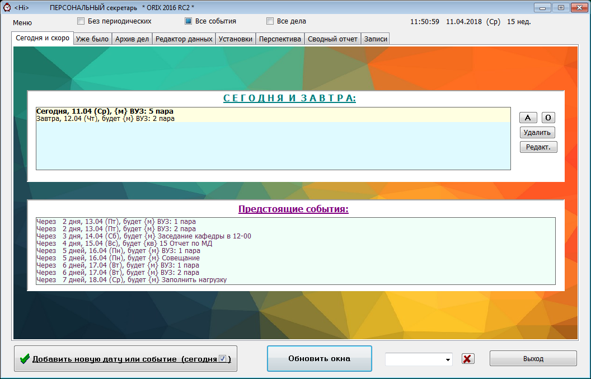
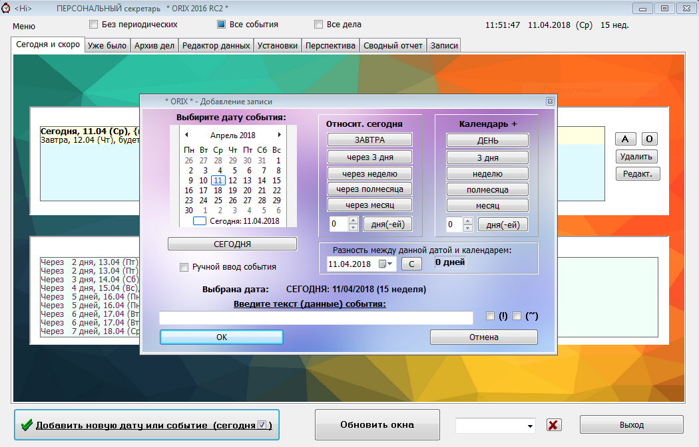

# Orix2016
Персональный личный секретарь

Orix - Программа является многофункциональным продуктом, незаменимым для секретарей, менеджеров и руководителей малых и средних предприятий: основная функция программы – это планирование, учет, оптимизация и контроль рабочего и свободного времени разрезе дней, событий и дел. Программа позволяет находить свободные и наиболее занятые дни, выдавать сводные отчеты о предстоящих праздниках и событиях, наглядно видеть срочные, а также выдавать задания, срок исполнения по которым истек. Существует возможность сохранения выполненных заданий в архиве.
В программе, начиная с версии «2.0» серии «Profile», сделана поддержка профилей пользователя.
